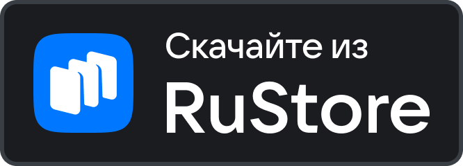

# Белый список? — Я в белых списках?

Android-приложение, которое одним нажатием определяет, действует ли в вашем регионе режим «белого списка» мобильного интернета.

**[Скачать APK (последний релиз)](https://github.com/dmitrystarosta/WhiteListCheck/releases/latest)**

## Когда пригодится

Если у вас отключили мобильный интернет или он работает странно — открываются только Яндекс, ВК и Госуслуги, а остальные сайты нет, — вероятно, в регионе действуют белые списки интернета (перечень доступных ресурсов, который ведёт Минцифры). Приложение делает быструю проверку блокировок и честно отвечает: включён ли белый список Минцифры, пропал ли интернет целиком или всё работает в обычном режиме.

## Как работает

Приложение параллельно проверяет три группы сайтов лёгкими HTTPS-запросами:

| Группа | Что проверяет | Примеры* |
|---|---|---|
| Белый список | Эталон доступности | Яндекс, ВК, Госуслуги, Mail.ru |
| Обычный интернет | Сайты вне списка  | Habr, 4PDA, Google, Википедия  |
| Заблокированные | Контрольная группа | Instagram**, X, Rutracker |

\* Списки сайтов можно настроить под свой регион прямо в приложении (шестерёнка): все три группы, добавление и удаление сайтов, сброс к стандартным.

Вердикт выносится по большинству в каждой группе:

- Белый список работает, обычный интернет нет → **включён белый список**
- Работают обе группы → всё в норме
- Не работает ничего → интернета нет вообще
- Открываются даже заблокированные → включён VPN или вы вне РФ

Приложение показывает тип сети и предупреждает, что на Wi-Fi результат может быть нерепрезентативен — кроме случая, когда Wi-Fi раздаёт 3G/4G-роутер: такой интернет тоже попадает под белые списки. Если трафик устройства идёт через VPN-туннель, приложение честно предупредит: проверка показывает интернет «через VPN», и для оценки реальной сети его стоит отключить. Определение — только штатными средствами Android: без сканирования установленных программ и без сторонних сервисов геолокации.

## Что ещё умеет

- **Поделиться вердиктом**: кнопка рядом с чипом «Сеть» отправляет результат проверки — с датой, временем и типом сети — в любой мессенджер. Удобно собирать картину по региону с друзьями.
- **Фоновая проверка**: раз в 15 минут приложение проверяет сеть само и присылает уведомление, когда режим сменился — например, белый список включили или выключили. Включается переключателем на главном экране.
- **Светлая и тёмная темы** — переключаются автоматически вслед за системной настройкой устройства.
- **Android TV**: приложение появляется в лаунчере телевизора, полностью управляется с пульта (подсветка выбранного элемента) и распознаёт кабельное подключение. На ТВ тема всегда тёмная — чтобы экран не слепил, ведь у многих телевизоров системного тёмного режима нет.

Все проверки выполняются локально на устройстве. Приложение не собирает данные, не содержит рекламы и не обращается ни к каким серверам, кроме проверяемых сайтов — подробнее в [PRIVACY.md](PRIVACY.md).

## Установка

  &nbsp;&nbsp;

Скачайте файл WhiteListCheck_v… .apk из [Releases](https://github.com/dmitrystarosta/WhiteListCheck/releases/latest), откройте на телефоне и разрешите установку. Требуется Android 8.0+.

**Google Play Protect** предупредит «App blocked» — это стандартно для любых приложений, установленных не из магазина. Нажмите **More details → Install anyway**. Код открыт, можно проверить и собрать самому.

Если у вас установлена версия 0.2 или старше, сначала удалите её: начиная с 0.2.1 приложение подписано новым ключом, и обновление поверх старых версий невозможно.

## Сборка

Проект собирается автоматически через GitHub Actions при каждом коммите: вкладка Actions → последняя сборка → Artifacts. Локально: открыть в Android Studio или `./gradlew assembleDebug` (release-сборка требует собственного ключа подписи).

## Планы

- Понятный вердикт для редкой ситуации «белый список недоступен, а остальной интернет работает»
- Обновляемый список сайтов с хостинга из белого списка

---
\** Instagram принадлежит Meta, признанной экстремистской и запрещённой в РФ.
